# Wiretapping probe to sniff packets directly from LAN cables

Michihiro Imaoka

---
# welcome!
# We am very grateful for the opportunity to present to you the  my wiretapping method. We would also like to thank all of you for coming here.

---
# Bio

Michihiro Imaoka is a founder of Imaoca Engineering Office in Japan. He is also a FPGA developer, an embedded system developer, and a technical writer. He has been a Microsoft MVP since 2014 (Windows development), Black Hat USA Arsenal presenter in 2020 and 2021.

---

# Objectives of this lecture
Detection and prevention of eavesdropping in LANs is generally performed at a higher layer than the physical layer. This is because commonly known eavesdropping methods are often attacks on the data link layer (L2) or its upper layers. This lecture will focus on methods of eavesdropping on the physical layer of the network that are often overlooked in the past. Participants will be able to conduct their own experiments and gain a better understanding of the vulnerabilities and countermeasures at the physical layer.

---
# Features of the probes to be introduced
- This probe is used by cutting a slit in the sheath of a LAN cable and tapping it into the metal wire inside. 
- It is very simple and inexpensive.
- Promiscuous mode is not detected.
- You can only capture one packet at a time, either upstream or downstream. If you want to see packets in the opposite direction, change the taps.
- You can tap the LAN cable while it is still active. So, since the network is not interrupted, the target will not be aware of the sniffing.
- This probe is 10BASE-T enabled.

---

# Warning
Unauthorized eavesdropping on another person's packet may be a crime.

---
# Warning in Japan
Unauthorized eavesdropping on another person's packet may be a crime. Eavesdropping on the communications of a third party (a party with whom you do not have mutual consent) and using or divulging the contents is considered an infringement of the confidentiality of communications and is subject to criminal penalties (imprisonment for up to two years or a fine of up to 1,000,000 yen). 

---
# targets and attacker
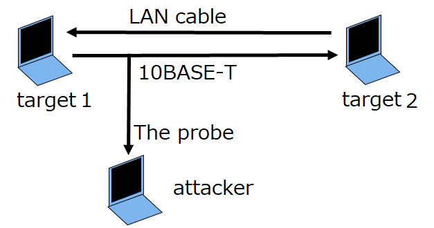
In this diagram, the attacker is sniffing packets sent from target 1 to target 2.
If you want to see packets sent from target 2 to target 1, you can reattach the probe to that cable.

---
# probe

This is the probe that packet sniffs directly from the LAN cable. It has an RJ-45 connector on one end and two alligator clips on the other. A pair of twisted pair cables connects between them. Connect the red clip because the striped wire is positive, and the black clip because the single color is negative. The RJ-45 Crimping Tool is required to make this probe.

---
# RJ-45
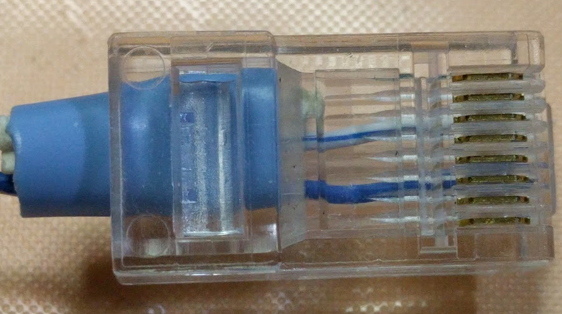
This is a photo of the RJ-45 with the nails on the back. There are terminals from No. 1 to No. 8 from the top. Connect the striped wire to the third terminal and the single-colored wire to the sixth terminal.

---
# Cut
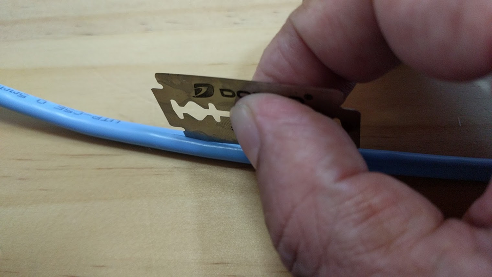
This assumes the cable the target is communicating with. Cut about 5 cm lengthwise. Longer cuts make the work easier, but may later be discovered by the targets.

---
# Extracting twisted pair cables
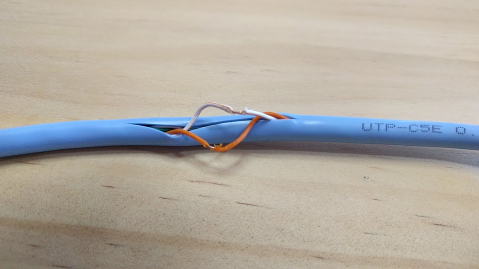
Take out the twisted pair cable with orange and orange stripes.
If you want to take a packet in the opposite direction, take out a blue and blue stripe pair.
Remove wire sheathing to connect clips. It is better to remove the sheathing a short distance away.
This is to avoid contact when you put it back on the cable later.

---
# tapping
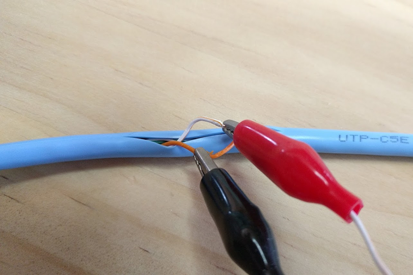
Tap the clip of the probe onto the wire where the sheath has been stripped off. The red clip taps on the stalipe wire and the black clip taps on the single-colored wire. If the wires have not made electrical contact with each other up to this point, the target's communication will not be disrupted and the wire tapping will not be noticed.

---
# settlement
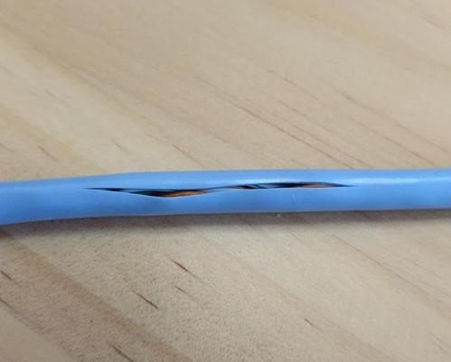
Return the crafted cables to their original state.
If the target was unaware and used the same cable, you can sniff it out by simply tapping it.

---
# Here is another method
- This method uses a splitter.
- It is easier because it is not necessary to cut the LAN cable.
- However, when connecting to the splitter, the target's communication will be interrupted for the duration.

---

# splitter method
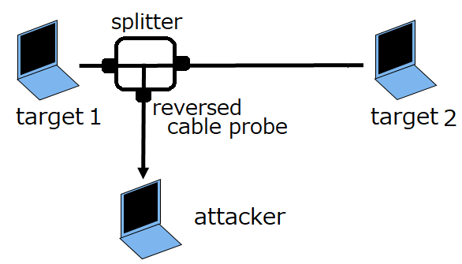
This method uses a splitter. The splitter is connected to the target LAN cable and the attacker's reversed cable probe. 
This method is also valid only for 10Base-T.

---

# splitter
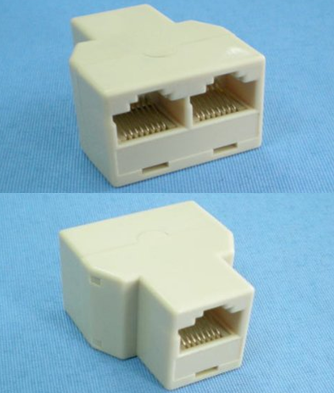
This is the splitter.
Three RJ-45 connectors can be connected.
Connect two LAN cables of the target and one probe of the attacker.

---
# inside of splitter
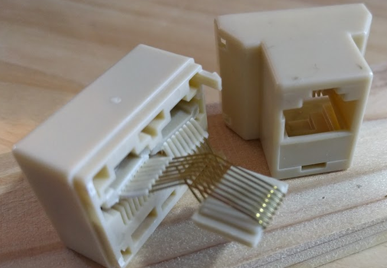
This is the inside of the splitter.
Each of the eight terminals is connected inside.
So it works no matter where the target's cable or the attacker's cable is connected.

---
# reversed cable probe
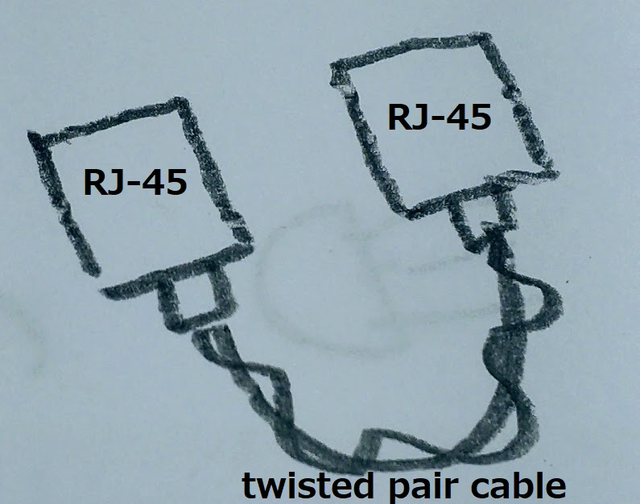
The use of a splitter requires the creation of a new probe.
It has two ends and an RJ-45 connector as shown in the figure. One connects to the splitter.
The other connects to the LAN connector on the attacker's PC.

---
# RJ-45 terminal connection
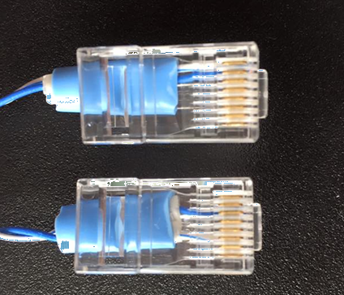
One RJ-45 connects a striped wire to pin 1 and a single-color wire to pin 2.
The other RJ-45 connects a striped wire to pin 3 and a single-color wire to pin 6.
If you want to get packets in the opposite direction, swap the PC connection of the probe and the splitter connection.

---
# From this point on, we will consider the detection of wiretaps.

---
# Measure cable resistance

The Network Interface Card (NIC) has a termination resistor.
The terminating resistor in the attacker's NIC goes in parallel to the cable.
The resistance between the cables usually drops.
By detecting this resistance, the attacker's wire tapping can be detected.

---
# This method prevents the detection of wire tapping
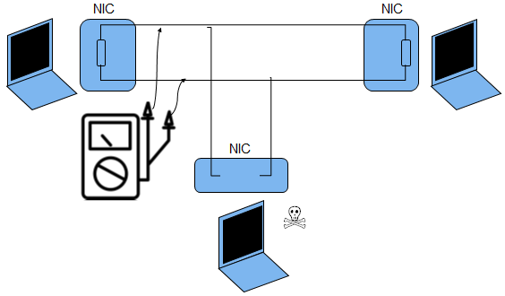
This is just an idea. It has not been verified yet.
The idea is to remove the terminating resistor of the attacker's NIC.
This will not affect the value of the resistance between the cables.
However, the LAN adapter will not be usable for its intended purpose.

---
# LAN adapter dedicated for wiretapping
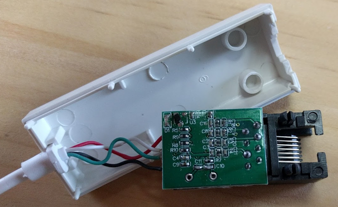
This is a picture of the inside of a certain LAN adapter. By removing one or more resistors from this device, you may be able to create a dedicated LAN adapter for wire tapping that no one will ever find.

---
# conclusion
Two Wiretapping methods were presented.
We showed how to detect wiretapping.
Ideas for avoiding detection were also discussed.
